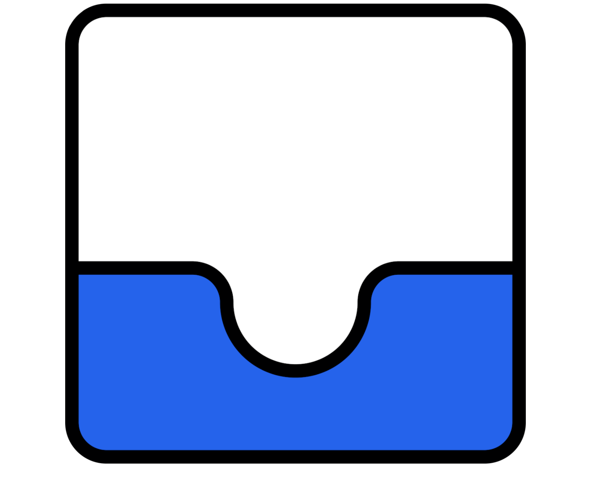

# Email Spam Detector

ML-based **email spam classification** with a **FastAPI inference backend** and a **browser extension UI** for real-world use. It uses a trained ML model to analyze email content and serve predictions through a simple API that connects directly to the browser extension.  
For more information, see the [Getting Started](https://github.com/viraj-sh/email-spam-detector/wiki/Getting-Started) wiki page.

<!--  -->

## Quick Start

> A **FastAPI backend** and a **Chrome extension for Gmail** are required.

### 1. Run the Backend

#### Option A — Use a Prebuilt Release (Recommended)

Download and run the backend build for your operating system:

#### Option B — Deploy to Render

> For additional setup methods (source build, Docker, etc.), see **Wiki → [Getting Started](https://github.com/viraj-sh/email-spam-detector/wiki/Getting-Started)**.

---

### 2. Install the Browser Extension

1. Download the **extension `.zip` file** from the [**Releases**](https://github.com/viraj-sh/email-spam-detector/releases) section.
2. Extract the archive to a folder on your computer.
3. Open Chrome and go to:
   [`chrome://extensions/`](chrome://extensions/)
4. Enable **Developer mode** (top right).
5. Click **Load unpacked**.
6. Select the extracted extension folder.

---

### 3. Connect the Extension to Your Backend

1. Click the extension icon in Chrome.
2. Enter the URL where your backend is running
   Example: `http://localhost:8000`

##### Understanding the Extension Status Icons

| Icon      | Meaning                                                   |
| ---------- | --------------------------------------------------------- |
|  | Backend is not reachable                                  |
|  | Backend is connected, but you are not on a supported page |
|  | Backend is connected and the extension is active          |

> Currently, the extension only runs on [**`mail.google.com`**](https://mail.google.com/). Support for additional sites may be added in the future.

## Spam Detection Model

| Component         | Details                                                 |
| ----------------- | ------------------------------------------------------- |
| **Vectorization** | TF-IDF                                                  |
| **Classifier**    | Linear SVM                                              |
| **Library**       | scikit-learn                                            |
| **Dataset**       | CSV files in `./dataset/`                               |
| **Preprocessing** | Custom `clean_text()` function in `./app/core/utils.py` |
| **Tuning**        | Grid Search with Cross-Validation                       |
| **Saved Model**   | Stored with `joblib` in `./app/model/`                  |

## Project Status

In **Partial Development**
**Check out [CONTRIBUTING.md](CONTRIBUTING.md) for detailed contribution guidelines.**
